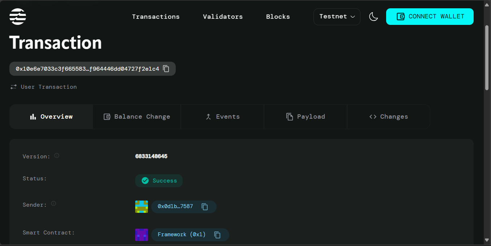

# Multi-Recipient Coin Transfers

## Project Description

A smart contract implementation for the Aptos blockchain that enables efficient batch transfer operations to multiple recipients in a single transaction. This contract allows users to send AptosCoin to multiple addresses simultaneously, reducing transaction costs and improving operational efficiency for businesses, organizations, and individuals who need to make frequent bulk payments.

## Project Vision

To streamline blockchain-based payments by providing a robust, gas-efficient solution for multi-recipient transfers. Our vision is to eliminate the need for multiple individual transactions when distributing funds to multiple parties, making bulk payments as simple as a single function call while maintaining security and transparency on the Aptos blockchain.

## Key Features

### 🚀 **Batch Transfer Operations**
- Send coins to multiple recipients in a single transaction
- Significant gas savings compared to individual transfers
- Support for varying amounts per recipient

### 📊 **Transfer Statistics Tracking**
- Track total number of batch transfers performed
- Monitor total number of recipients served
- Personal analytics for transfer history

### 🔒 **Security & Validation**
- Input validation ensures recipients and amounts arrays match
- Prevents empty batch transfers
- Built-in error handling for invalid operations

### ⚡ **Gas Efficiency**
- Optimized for minimal gas consumption
- Single transaction for multiple transfers
- Reduced blockchain network congestion

### 🎯 **Flexible Amount Distribution**
- Support for different amounts per recipient
- No limit on number of recipients (within gas constraints)
- Ideal for payroll, airdrops, and reward distributions

## Future Scope

### 📈 **Enhanced Analytics**
- Detailed transfer history with timestamps
- Recipient frequency tracking
- Amount distribution analytics
- Monthly/yearly transfer summaries

### 🔄 **Recurring Transfers**
- Schedule automated batch transfers
- Set up recurring payments to fixed recipients
- Time-based trigger mechanisms

### 💰 **Multi-Token Support**
- Extend beyond AptosCoin to other fungible tokens
- Mixed token batch transfers
- Cross-token conversion during transfers

### 🛡️ **Advanced Security Features**
- Multi-signature support for large transfers
- Transfer limits and approval workflows
- Whitelist/blacklist functionality for recipients

### 🔌 **Integration Capabilities**
- REST API for external applications
- SDK for easy integration
- Webhook notifications for transfer confirmations

### 📱 **User Experience Improvements**
- Web interface for batch transfer management
- CSV import for recipient lists
- Transfer templates for common distributions

## Contract Details
 0x10e6e7033c3f6655838598a66f9a785eb4bf93c85f9df964446dd04727f2e1c4
 
 